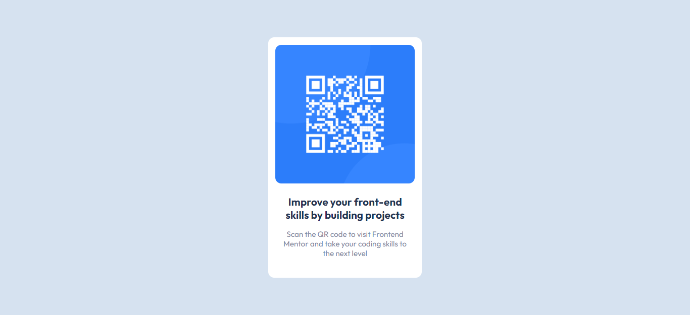

# Frontend Mentor - QR code component solution

This is a solution to the [QR code component challenge on Frontend Mentor](https://www.frontendmentor.io/challenges/qr-code-component-iux_sIO_H). Frontend Mentor challenges help you improve your coding skills by building realistic projects. 

## Table of contents

  - [Screenshot](#screenshot)
- [My process](#my-process)
  - [Built with](#built-with)
  - [What I learned](#what-i-learned)
  - [Continued development](#continued-development)
- [Author](#author)

### Screenshot

## My process

I started with the layout in HTML. Didn't want to assign a class to everything since it's a small project. As for CSS, went from the global variables and body element all the way down to styling the child components. Also, I figured that there is no need for a @media query. 

### Built with

- Semantic HTML5 markup
- CSS custom properties
- CSS global variables
- Flexbox
- Mobile-first workflow

### What I learned

Actually, I am using these beginner tasks to brush up on my rusty web dev knowledge, but I did take a new approach with the styling, starting from the top parent element and going down the scope, and for the first time I used CSS global variables.

### Continued development

Nothing specific. I will tackle all of these tasks starting from the easiest. My goal is to simulate the real web dev job flow with all the ups and downs.

## Author

- Frontend Mentor - [@floatingPebble](https://www.frontendmentor.io/profile/floatingPebble)
